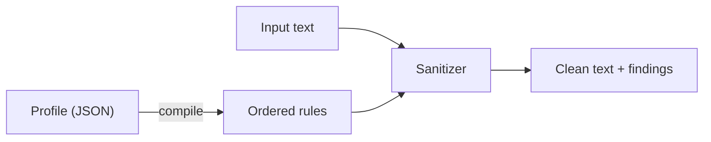
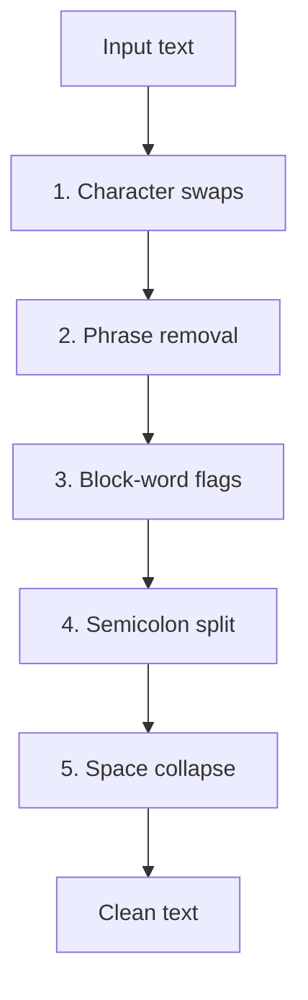

# How slop-chop works

A short tour of the engine: how a profile becomes rules, the order those rules run in,
and what `check` and `fix` actually do.

## Contents

- [At a glance](#at-a-glance)
- [The pieces](#the-pieces)
- [The five rule kinds](#the-five-rule-kinds)
- [The order they run in](#the-order-they-run-in)
- [check vs fix](#check-vs-fix)
- [A worked example](#a-worked-example)
- [Which rules rewrite](#which-rules-rewrite)
- [Under the hood](#under-the-hood)
- [Where the rules stop](#where-the-rules-stop)

## At a glance

A profile compiles into an ordered list of rules. The sanitizer holds those rules and
runs your text through them.



The rules run in a fixed sequence, each pass handing its output to the next.



## The pieces

| Piece     | Role                                                                     |
| --------- | ------------------------------------------------------------------------ |
| Profile   | Plain JSON config. Lists what to swap and what to flag.                   |
| Rules     | The compiled profile. An ordered list, each a regex plus an action.      |
| Sanitizer | Holds the rules and runs them over your text.                            |

## The five rule kinds

Each entry in a profile compiles into one or more rules. Every rule is a compiled regular
expression paired with an action.

| Kind            | Matches                  | Action      | Example                        |
| --------------- | ------------------------ | ----------- | ------------------------------ |
| Character swap  | a literal character      | rewrite     | `—` becomes `, `               |
| Phrase removal  | a phrase, any casing     | rewrite     | `In summary, ` becomes empty   |
| Block word      | a whole word or term     | flag only   | `comprehensive`, `blast radius`|
| Semicolon split | `;` then space, a letter | rewrite     | `; it` becomes `. It`          |
| Space collapse  | two or more spaces       | rewrite     | two spaces become one          |

A few notes on the matching:

- Character swaps match the literal text, so nothing inside it acts as a regex.
- Phrase keys keep the trailing comma and space, so deleting one leaves a clean sentence
  rather than a dangling comma.
- Block words match on word boundaries, so `robust` matches the standalone word and not
  the middle of a longer one. Multi-word terms like `blast radius` work the same way.

## The order they run in

| Step | Stage           | Note                                                       |
| ---- | --------------- | ---------------------------------------------------------- |
| 1    | Character swaps |                                                            |
| 2    | Phrase removal  |                                                            |
| 3    | Block-word flags| Flags only, never changes the text.                        |
| 4    | Semicolon split |                                                            |
| 5    | Space collapse  | Runs last to mop up spaces the earlier swaps leave behind. |

Why space collapse goes last: take the input `word — word`. The em-dash becomes a comma
and a space, which leaves two spaces around the comma, and the final pass tidies it.
Phrase removal can also leave a stray space at the start of a line, and the same pass
cleans that.

## check vs fix

Both run the same rules. They differ in what they do with the matches.

|                  | `check`                       | `fix`                         |
| ---------------- | ----------------------------- | ----------------------------- |
| Changes the text | No                            | Yes                           |
| Writes to        | findings on stderr            | clean text on stdout          |
| Exit code        | non-zero when it finds slop   | zero                          |
| Good for         | a CI gate                     | cleaning a file               |
| Positions        | exact, since it scans the original | not reported             |

`fix` runs `check` first to gather findings against the original, then applies the
rewriting rules in order.

## A worked example

Input:

```text
In summary, a comprehensive—and robust—plan; it works.
```

`slop-chop check` reports every match and exits non-zero:

```text
1:28 char:—: "—" -> ", "
1:39 char:—: "—" -> ", "
1:1 phrase:in summary,: "In summary, "
1:15 word:comprehensive: "comprehensive"
1:33 word:robust: "robust"
1:44 semicolon: "; i" -> ". I"
slop-chop: 6 finding(s)
```

`slop-chop fix` returns the cleaned text:

```text
a comprehensive, and robust, plan. It works.
```

Note that `comprehensive` and `robust` are still there. They are block words, so the
engine flags them but leaves the swap to you.

## Which rules rewrite

| Rule            | What it does |
| --------------- | ------------ |
| Character swap  | rewrites     |
| Phrase removal  | rewrites     |
| Semicolon split | rewrites     |
| Space collapse  | rewrites     |
| Block word      | flags only   |

The rewriting rules are safe without knowing the surrounding sentence. Block words are
not, since the right replacement for a word like `comprehensive` depends on context, so
the engine marks them and leaves the call to you.

## Under the hood

<details>
<summary>How the semicolon split works</summary>

The rule matches a semicolon, the spaces after it, and the first letter of the next word.
It drops the semicolon, ends the clause with a period, adds one space, and puts the
captured letter back as a capital. So `it works; it ships` turns into `it works. It
ships`.

It only fires when the semicolon joins two clauses. Before splitting, it looks at the
sentence around the semicolon. If that sentence holds more than one semicolon, or if a
coordinating conjunction like "and" or "or" follows, the semicolon is treated as a list
separator and left alone. So `we support Go; Python; and Rust` is not touched. This is a
heuristic, not a parser, so a rare case can still slip through, and matching a voice or
reworking a clause more deeply is a job for the rewrite pass.

</details>

<details>
<summary>How line and column numbers are computed</summary>

Each finding reports a line and a column worked out from the byte offset of the match.
The line is one plus the number of newlines before the offset. The column is one plus the
number of runes between the start of the line and the offset. Counting runes instead of
bytes keeps the column honest when the text holds characters wider than a single byte.

</details>

<details>
<summary>Why the output is identical on every run</summary>

Within a single kind, the entries get sorted before they compile. Map order in Go is not
stable, and sorting keeps the rule list, and the output, the same from one run to the
next.

</details>

## Where the rules stop

The rules pass is deterministic, cheap, and good at the common tells, but it cannot reword
a sentence, judge tone, or match a voice. That takes a model. The plan is to keep the
rules as the default and add the model pass behind a flag, so the cheap and predictable
path stays the one you reach for most.
