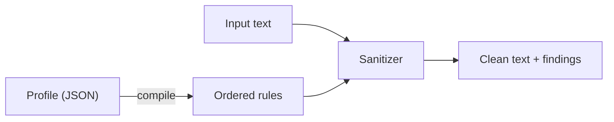
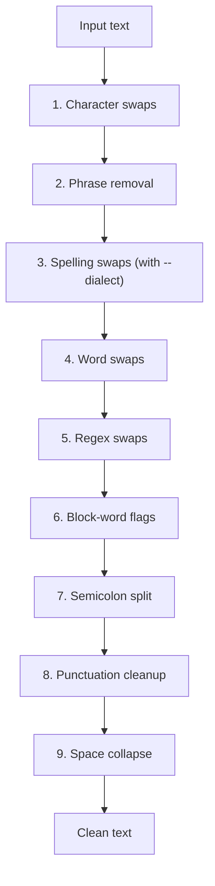

# How slop-chop works

A short tour of the engine: how a profile becomes rules, the order those rules run in,
and what `check` and `fix` actually do.

## Contents

- [At a glance](#at-a-glance)
- [The pieces](#the-pieces)
- [The six rule kinds](#the-six-rule-kinds)
- [The order they run in](#the-order-they-run-in)
- [check vs fix](#check-vs-fix)
- [A worked example](#a-worked-example)
- [Which rules rewrite](#which-rules-rewrite)
- [What the engine skips](#what-the-engine-skips)
- [Under the hood](#under-the-hood)
- [Where the rules stop](#where-the-rules-stop)

## At a glance

A profile compiles into an ordered list of rules. The sanitizer holds those rules and
runs your text through them.



The rules run in a fixed sequence, each pass handing its output to the next.



## The pieces

| Piece     | Role                                                                     |
| --------- | ------------------------------------------------------------------------ |
| Profile   | Plain JSON config. Lists what to swap and what to flag.                   |
| Rules     | The compiled profile. An ordered list, each a regex plus an action.      |
| Sanitizer | Holds the rules and runs them over your text.                            |

## The nine rule kinds

Each entry in a profile compiles into one or more rules. Every rule is a compiled regular
expression paired with an action. The `collapseSpaces` field compiles into the last two,
which together tidy the debris the earlier rewrites leave behind. The spelling swap appears
only when `--dialect` or a profile's `dialect` field asks for one, and the word and regex
swaps appear only when a profile lists them. See
[docs/PROFILE.md](docs/PROFILE.md) for the field that drives each kind.

| Kind                | Matches                     | Action      | Example                        |
| ------------------- | --------------------------- | ----------- | ------------------------------ |
| Character swap      | a literal character         | rewrite     | `—` becomes `, `               |
| Phrase removal      | a phrase, any casing        | rewrite     | `In summary, ` becomes empty   |
| Spelling swap       | a dialect spelling          | rewrite     | `behaviour` becomes `behavior` |
| Word swap           | a whole word, any casing    | rewrite     | `utilize` becomes `use`        |
| Regex swap          | your own pattern            | rewrite     | `50%` becomes `50 percent`     |
| Block word          | a whole word or term        | flag only   | `comprehensive`, `blast radius`|
| Semicolon split     | `;` then space, a letter    | rewrite     | `; it` becomes `. It`          |
| Punctuation cleanup | spaces before punctuation   | rewrite     | `word ,` becomes `word,`       |
| Space collapse      | two or more spaces          | rewrite     | two spaces become one          |

A few notes on the matching:

- Character swaps match the literal text, so nothing inside it acts as a regex.
- Phrase keys keep the trailing comma and space, so deleting one leaves a clean sentence
  rather than a dangling comma.
- A phrase whose last character is a word, like the bare word `cat`, matches only as a
  whole word, so it never fires inside `category`. A phrase that ends in punctuation is
  bounded by that punctuation instead.
- Deleting a phrase that opened a sentence restores the capital on the word after it, so
  `In summary, it works.` becomes `It works.` and not `it works.`. A phrase deleted
  mid-sentence leaves the next word lowercase.
- Block words match on word boundaries, so `robust` matches the standalone word and not
  the middle of a longer one. Multi-word terms like `blast radius` work the same way.
- Spelling swaps are a word-for-word lookup, not a suffix rule, so a word that shares an
  ending but no dialect difference, like `size`, is never touched. The swap keeps the
  match's case, and a word whose other-dialect spelling doubles as an unrelated word, like
  `cheque` and `check`, rewrites only toward American.
- Word swaps match a whole word without regard to case, and the replacement takes the case
  of what it replaced, so one entry covers `utilize`, `Utilize`, and `UTILIZE`.
- Regex swaps use the pattern as written, so you set the anchoring yourself. A reference
  like `$1` in the replacement expands against the match, and a pattern that can match
  nothing is skipped rather than inserted between every character.
- A phrase or a multi-word term still matches when a line wrap splits it. The gap
  between its words can be spaces, tabs, or one line break, but never a blank line, so
  nothing matches across a paragraph break.
- The semicolon split stays within one line. A semicolon right before a line break is
  left alone, so the split never swallows a newline and reflows a paragraph.
- Both cleanup rules skip the start of a line, so indentation survives. The space
  collapse also leaves markdown table rows alone, since their runs of spaces are
  alignment padding, and it never touches a run at the end of a line, since two
  trailing spaces are a markdown hard break.

## The order they run in

| Step | Stage               | Note                                                        |
| ---- | ------------------- | ----------------------------------------------------------- |
| 1    | Character swaps     |                                                             |
| 2    | Phrase removal      |                                                             |
| 3    | Spelling swaps      | Only with a dialect. Rewrites the other dialect's spelling. |
| 4    | Word swaps          | Only with `wordReplace`. Whole-word, case-carrying.         |
| 5    | Regex swaps         | Only with `regexReplace`. Your own patterns.                |
| 6    | Block-word flags    | Flags only, never changes the text.                         |
| 7    | Semicolon split     |                                                             |
| 8    | Punctuation cleanup | Drops spaces left in front of punctuation.                  |
| 9    | Space collapse      | Runs last to mop up spaces the earlier swaps leave behind.  |

Why the cleanup stages go last: take the input `word — word`. The em-dash becomes a comma
and a space, which leaves `word ,  word`. The punctuation pass pulls the comma back
against the word, the collapse pass folds the leftover double space, and the result is
`word, word`.

## check vs fix

Both run the same rules. They differ in what they do with the matches.

|                  | `check`                       | `fix`                         |
| ---------------- | ----------------------------- | ----------------------------- |
| Changes the text | No                            | Yes                           |
| Writes to        | findings on stderr            | clean text on stdout          |
| Exit code        | non-zero when it finds slop   | zero                          |
| Good for         | a CI gate                     | cleaning a file               |
| Positions        | exact, against the original   | same findings with `--json`, positions from the original |

`fix` runs `check` first to gather findings against the original, then applies the
rewriting rules in order. Findings come back sorted by position in the text, so a match
on line 1 always prints before a match on line 2, whatever rule found it.

## A worked example

Input:

```text
In summary, a comprehensive—and robust—plan; it works.
```

`slop-chop check` reports every match in text order and exits non-zero:

```text
1:1 phrase:in summary,: "In summary, a" -> "A"
1:15 word:comprehensive: "comprehensive"
1:28 char:—: "—" -> ", "
1:33 word:robust: "robust"
1:39 char:—: "—" -> ", "
1:44 semicolon: "; i" -> ". I"
slop-chop: 6 finding(s)
```

The phrase match reaches one letter past the phrase. That letter is what gets the
capital back when the deletion leaves it opening the sentence.

`slop-chop fix` returns the cleaned text:

```text
A comprehensive, and robust, plan. It works.
```

Note that `comprehensive` and `robust` are still there. They are block words, so the
engine flags them but leaves the swap to you.

## Which rules rewrite

| Rule                | What it does |
| ------------------- | ------------ |
| Character swap      | rewrites     |
| Phrase removal      | rewrites     |
| Spelling swap       | rewrites     |
| Word swap           | rewrites     |
| Regex swap          | rewrites     |
| Semicolon split     | rewrites     |
| Punctuation cleanup | rewrites     |
| Space collapse      | rewrites     |
| Block word          | flags only   |

The rewriting rules are safe without knowing the surrounding sentence. Block words are
not, since the right replacement for a word like `comprehensive` depends on context, so
the engine marks them and leaves the call to you.

## What the engine skips

Markdown code is off limits. A fenced block, opened with three or more backticks or
tildes and running through its closing fence or to the end of the file, never matches
any rule. The same goes for an inline span between backticks. An em-dash in a shell
example or a semicolon in a code sample stays exactly as written, in `check` and in
`fix` alike.

A lone backtick with no closing partner before the next blank line is plain text, so
one stray character does not hide the rest of a paragraph from the rules.

Two more things drop a match. A word in the profile's `allow` list is exempt from every
rule, matched against the exact text a rule matched, without regard to case, so a false
positive can be silenced without turning off the rule that raised it. And a line carrying
an inline directive is skipped: `<!-- slop-chop-ignore -->` silences its own line and
`<!-- slop-chop-ignore-next-line -->` silences the line after it, the way a linter pragma
does. Both the allow list and the directives apply to `check` and `fix` alike. See
[docs/PROFILE.md](docs/PROFILE.md) for how to use them.

## Under the hood

<details>
<summary>How the semicolon split works</summary>

The rule matches a semicolon, the spaces after it, and the first letter of the next word.
It drops the semicolon, ends the clause with a period, adds one space, and puts the
captured letter back as a capital. So `it works; it ships` turns into `it works. It
ships`.

It only fires when the semicolon joins two clauses. Before splitting, it looks at the
sentence around the semicolon. If that sentence holds more than one semicolon, or if a
coordinating conjunction like "and" or "or" follows, the semicolon is treated as a list
separator and left alone. So `we support Go; Python; and Rust` is not touched. The match
also stays within one line, so a semicolon at the end of a line never swallows the line
break after it. This is a heuristic, not a parser, so a rare case can still slip
through, and matching a voice or reworking a clause more deeply is a job for the
rewrite pass.

</details>

<details>
<summary>How the capital comes back after a phrase delete</summary>

A deletion phrase matches one letter past the phrase itself. When the phrase sat at the
start of a sentence, at the start of the text, or right after a period, an exclamation
point, a question mark, or a line break, the kept letter is written back as a capital.
Anywhere else it keeps its case, so `and to be honest, it works` becomes `and it works`.

</details>

<details>
<summary>How line and column numbers are computed</summary>

Each finding reports a line and a column worked out from the byte offset of the match.
The line is one plus the number of newlines before the offset. The column is one plus the
number of runes between the start of the line and the offset. Counting runes instead of
bytes keeps the column honest when the text holds characters wider than a single byte.

</details>

<details>
<summary>Why the output is identical on every run</summary>

Within a single kind, the entries get sorted before they compile. Map order in Go is not
stable, and sorting keeps the rule list the same from one run to the next. Findings get
a second sort by position in the text, with the rule name as the tie break, so the
report reads top to bottom no matter which rule matched first.

</details>

## Where the rules stop

The rules pass is deterministic, cheap, and good at the common tells, but it cannot reword
a sentence, judge tone, or match a voice. That takes a model, and that pass exists: run
`fix --rewrite` to send the rules output through one. It needs an API key and costs money,
so the cheap and predictable rules pass stays the default and the one you reach for most.

A model can drift, so its reply is not trusted blind. After the model returns, the rules
run once more over the reply. Any deterministic tell the model reintroduced is cleaned
again, and a warning goes to stderr. Buzzwords the rules only flag are reported when the
model failed to drop them. The code segments of the reply are compared against the input,
so a model that altered a fenced block, an inline span, or an indented block is caught and
called out.

The reply is also checked for fact drift, deterministically and for free. slop-chop pulls
the load-bearing tokens out of the prose, the numbers, percentages, money, URLs, emails,
and all-caps acronyms, and diffs the set against the input. A dropped or added token,
like a percentage that changed or a link that vanished, is reported on stderr as a likely
fact change. This does not judge meaning, so a reworded claim with the same numbers passes
quietly, but the high-consequence, checkable drift no longer slips through. The rewrite
stays best-effort, but its output can no longer quietly break the guarantees the rules
pass makes.

For the meaning no deterministic check can see, a flipped negation or a softened claim,
`fix --rewrite --verify` adds a model pass of its own. It sends the original and the
rewrite to a model and asks for a strict JSON verdict on whether the meaning held, then
reports each change on stderr. This is Layer 3: it costs a second call and is only as
sure as the model, so it is off by default, and a verdict it cannot run or parse is a
warning, not a failure, since the rewrite is already valid output.

By default the verdict only warns. Three flags change that. `--verify-retry N` feeds the
flagged issues back: they become notes on the rewrite prompt, and the rewrite runs again,
up to N more times, until the check passes or the tries run out. `--verify-strict` makes a
change that survives fail the command, so a pipeline stops on drift, and the rewrite is
still written first. With `--json` the verdict goes into the report as a `verify` object,
there only when the check ran, so a program can read it without parsing stderr.
